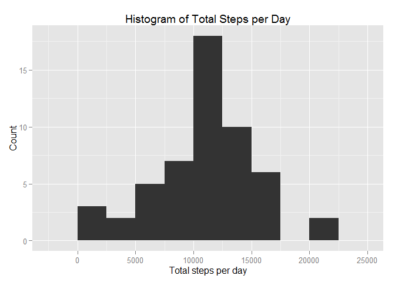
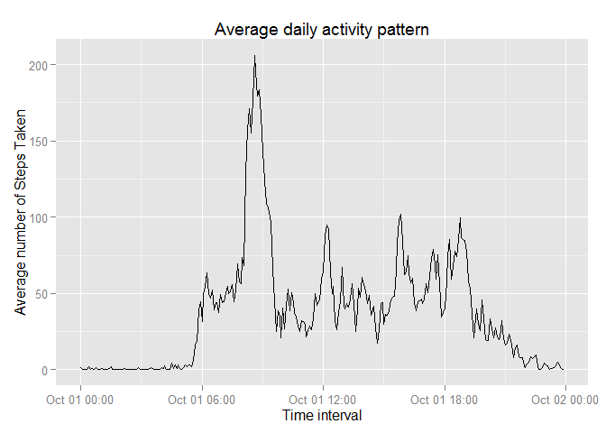
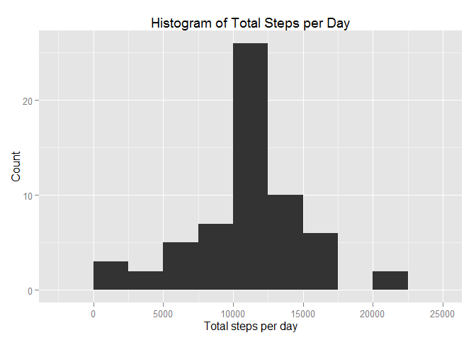
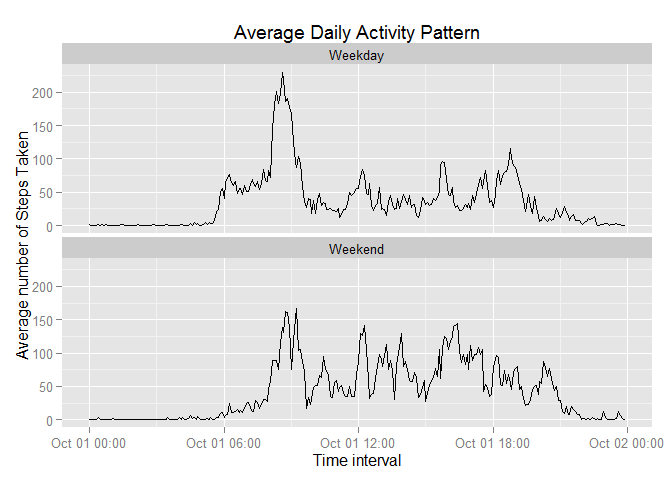

# Reproducible Research: Peer Assessment 1

## Loading and preprocessing the data
First we load the data. For preprocessing we convert the interval variable to a time variable so that we can plot a time series.


```r
library(ggplot2)
library(reshape2)
act = read.csv("activity.csv")
act$min = act$interval%%100
act$hour = as.integer(act$interval/100)
act$tim= strptime(paste(act$date,act$hour,act$min), "%Y-%m-%d %H %M")
```

## What is mean total number of steps taken per day?
I have used ggplot2 to plot the graphs. The R code is as follows:


```r
tot = tapply(act$steps,act$date, sum)
g = ggplot(data.frame(tot),aes(x= tot)) + geom_bar(binwidth = 2500)
g + labs(x = "Total steps per day", y = "Count", title = "Histogram of Total Steps per Day")
```

 

```r
m = mean(tot, na.rm=TRUE)
med = median(tot, na.rm=TRUE)
paste("Mean:", m)
```

```
## [1] "Mean: 10766.1886792453"
```

```r
paste("Median:", med)
```

```
## [1] "Median: 10765"
```

## What is the average daily activity pattern?
Here I have used tapply ot compute the averages.


```r
avg = tapply(act$steps, act$interval, mean,na.rm=TRUE)
avg = as.data.frame(avg)
colnames(avg) = "average"
avg$average = as.numeric(avg$average)
avg = cbind(avg,tim = act$tim[1:nrow(avg)])
g = ggplot(data = avg,aes(x= avg$tim,y = avg$average)) + geom_line()
g + labs(x = "Time interval", y = "Average number of Steps Taken", title = "Average daily activity pattern")
```

 

```r
x=which.max(avg$average)
paste("The interval with the most number of steps is:", act$interval[x])
```

```
## [1] "The interval with the most number of steps is: 835"
```

## Imputing missing values
First I report the number of missing values in the data set. The imputation strategy I have used is to replace the missing values with the mean for that 5-minute interval.
Then I have created a new dataset with the imputed values.


```r
paste("The total number of NA values is", sum(is.na(act)))
```

```
## [1] "The total number of NA values is 2304"
```

```r
act2=act
x=rownames(avg)
x=as.integer(x)
avg=cbind(avg,x)
for(i in 1:nrow(act2)){
  if(is.na(act2$steps[i])){
    inter=act2$interval[i]
    y=which(avg$x==inter)
    act2$steps[i]=avg$average[y]
  }
}

tot = tapply(act2$steps,act2$date, sum)
g = ggplot(data.frame(tot),aes(x= tot)) + geom_bar(binwidth = 2500)
g + labs(x = "Total steps per day", y = "Count", title = "Histogram of Total Steps per Day")
```

 

```r
m = mean(tot, na.rm=TRUE)
med = median(tot, na.rm=TRUE)
paste("Mean:", m)
```

```
## [1] "Mean: 10766.1886792453"
```

```r
paste("Median:", med)
```

```
## [1] "Median: 10766.1886792453"
```

Here we can see that the mean remains the same and the mean and the median are now equal.

## Are there differences in activity patterns between weekdays and weekends?

Here I have added a new factor variable to the dataset to determine if it is a  weekday. Then I used tapply with two factors to get the averages. I have also melted the average data frame so that it can be used with ggplot2


```r
act2$week = as.factor(c("Weekday","Weekend"))
for(i in 1:nrow(act2)){
  weekd = weekdays(act2$tim[i])
  if(weekd=="Sunday" | weekd=="Saturday"){
    act2$week[i] = "Weekend"
  }
  else{
    act2$week[i] = "Weekday"
  }
}
avg = as.data.frame(tapply(act2$steps, list(act2$interval,act2$week), mean,na.rm=TRUE))
avg = cbind(avg,tim = act2$tim[1:nrow(avg)])
avg = melt(avg, id.vars = "tim", variable.name = "week", value.name = "average")
g = ggplot(data = avg,aes(x= avg$tim,y = avg$average)) + geom_line() + facet_wrap(~week, nrow=2)
g + labs(x = "Time interval", y = "Average number of Steps Taken", title = "Average Daily Activity Pattern")
```

 
